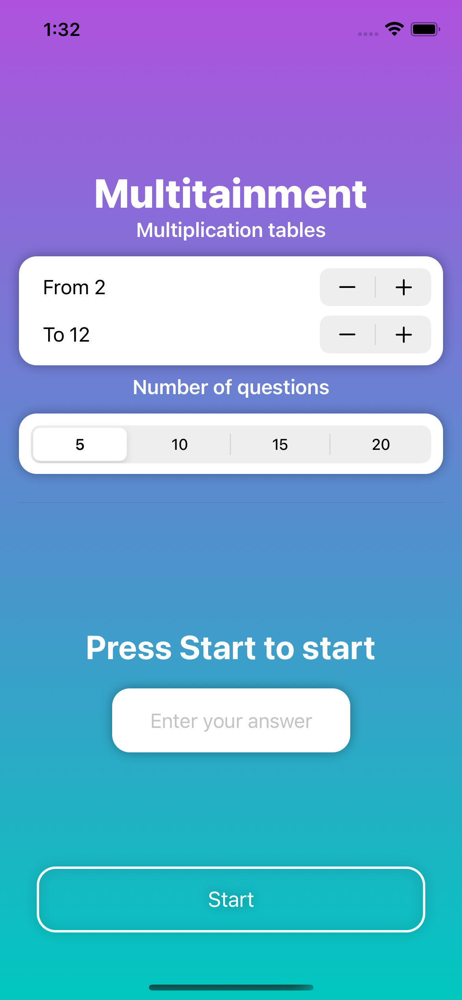

# Multitainment
Challenge(Day 35) of Hacking With Swift

An app to practice your multiplication tables. 

## How to use
- Choose the multiplication tables you want to practice(1-20)
- Choose the number of questions per round
- Press the start button and answer the questions

